# Project Management System (PMSHub)

[](https://www.oracle.com/java/)
[](https://spring.io/projects/spring-boot)
[](https://react.dev/)
[](https://www.docker.com/)
[](https://www.postgresql.org/)
[](https://github.com/features/actions)

A microservices-based project management application designed to handle collaborative workspaces, member assignments, task tracking, and user profile management. The system is built using Spring Boot for backend microservices, React for the frontend, and PostgreSQL and Redis for persistence and caching.

---

## ⚡ Quick Start

To spin up the entire application along with PostgreSQL, Redis, and Maildev containers:

```bash
# 1. Compile and install the shared library dependency
mvn -f common/pom.xml clean install

# 2. Start all services and backing databases via Docker Compose in detached mode
docker compose up --build -d
```
Once started, the frontend is available at `http://localhost:3000` (mapped to port 80 inside the container) and the API Gateway is accessible at `http://localhost:8080`.

---

## 🏗️ Architecture Overview

The application is structured as a set of independent backend microservices and a React SPA frontend communicating through an API Gateway.

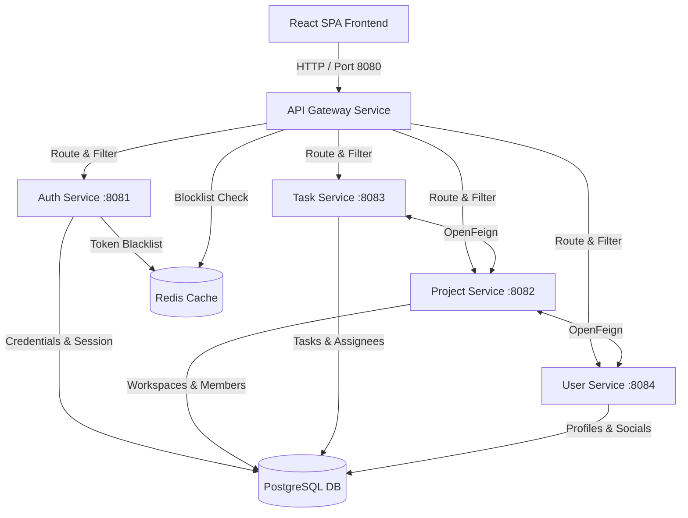
```mermaid
graph TD
    Client[React SPA Frontend] -->|HTTP / Port 8080| Gateway[API Gateway Service]
    
    Gateway -->|Route & Filter| AuthService[Auth Service :8081]
    Gateway -->|Route & Filter| ProjectService[Project Service :8082]
    Gateway -->|Route & Filter| TaskService[Task Service :8083]
    Gateway -->|Route & Filter| UserService[User Service :8084]
    
    AuthService -->|Token Blacklist| Redis[(Redis Cache)]
    Gateway -->|Blocklist Check| Redis
    
    AuthService -->|Credentials & Session| PostgreSQL[(PostgreSQL DB)]
    ProjectService -->|Workspaces & Members| PostgreSQL
    TaskService -->|Tasks & Assignees| PostgreSQL
    UserService -->|Profiles & Socials| PostgreSQL
    
    ProjectService <-->|OpenFeign| UserService
    TaskService <-->|OpenFeign| ProjectService
```

### Microservice Flow
1. **Routing**: The API Gateway acts as the single entry point, routing requests based on path patterns.
2. **Authentication**: The API Gateway intercepts requests and validates JWT tokens. It queries Redis to verify that the token has not been blacklisted (e.g., via logout).
3. **Internal Communication**: Microservices communicate synchronously using Spring Cloud OpenFeign. For example, the Task Service calls the Project Service to verify project membership before assigning a task.
4. **Data Isolation**: Each microservice maintains its own schema within PostgreSQL to ensure loose coupling. Shared data is referenced using UUIDs.

---

## 🛠️ Technology Stack

- **Backend**: Java 21, Spring Boot 3.4.5, Spring Security, Spring Cloud Gateway, Spring Cloud OpenFeign
- **Frontend**: React 19, TypeScript, Redux Toolkit, React Router DOM 7, TailwindCSS 4, Vite 8
- **Databases**: PostgreSQL (Relational persistence), Redis (Token blocklist, rate limiting, and email cooldowns)
- **Deployment & CI/CD**: Docker, Docker Compose, GitHub Actions, DockerHub

---

## 📊 Database Schema (Entity-Relationship Diagram)

Logical foreign keys (such as assigning users to tasks or project memberships) are handled at the application layer using UUID references to maintain database boundary isolation.

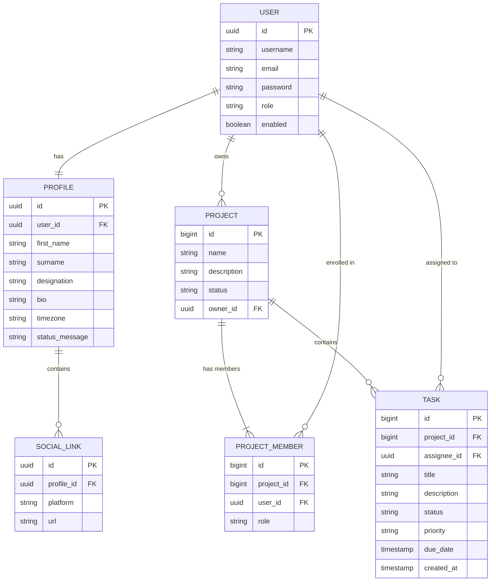
```mermaid
erDiagram
    USER {
        uuid id PK
        string username
        string email
        string password
        string role
        boolean enabled
    }

    PROFILE {
        uuid id PK
        uuid user_id FK
        string first_name
        string surname
        string designation
        string bio
        string timezone
        string status_message
    }

    SOCIAL_LINK {
        uuid id PK
        uuid profile_id FK
        string platform
        string url
    }

    PROJECT {
        bigint id PK
        string name
        string description
        string status
        uuid owner_id FK
    }

    PROJECT_MEMBER {
        bigint id PK
        bigint project_id FK
        uuid user_id FK
        string role
    }

    TASK {
        bigint id PK
        bigint project_id FK
        uuid assignee_id FK
        string title
        string description
        string status
        string priority
        timestamp due_date
        timestamp created_at
    }

    USER ||--|| PROFILE : "has"
    PROFILE ||--o{ SOCIAL_LINK : "contains"
    USER ||--o{ PROJECT : "owns"
    PROJECT ||--|{ PROJECT_MEMBER : "has members"
    PROJECT ||--o{ TASK : "contains"
    USER ||--o{ PROJECT_MEMBER : "enrolled in"
    USER ||--o{ TASK : "assigned to"
```

---

## 📁 Repository Structure

```text
project-management-system/
├── common/             # Shared library for security filters, exception handling, and tracing
├── apigateway/         # Spring Cloud Gateway routing service
├── authservice/        # Authentication, registration, and password management
├── projectservice/     # Workspace and project collaboration management
├── taskservice/        # Kanban task tracking and assignment management
├── userservice/        # Profile directories and developer social accounts
├── frontend/           # React SPA client application
├── postman/            # Postman API test collection
└── .github/            # GitHub Actions CI/CD workflows
```

---

## 💻 Environment Variables

Each microservice maintains its own PostgreSQL database/schema configuration. Create a `.env` file in the root directory based on the following template:

```env
# PostgreSQL Configuration (Service-Specific Schema Mappings)
POSTGRES_USER=postgres
POSTGRES_PASSWORD=yourpassword
AUTH_DB_URL=jdbc:postgresql://postgres:5432/auth_db
PROJECT_DB_URL=jdbc:postgresql://postgres:5432/project_db
TASK_DB_URL=jdbc:postgresql://postgres:5432/task_db
USER_DB_URL=jdbc:postgresql://postgres:5432/user_db

AUTH_DB_USERNAME=postgres
AUTH_DB_PASSWORD=yourpassword
PROJECT_DB_USERNAME=postgres
PROJECT_DB_PASSWORD=yourpassword
TASK_DB_USERNAME=postgres
TASK_DB_PASSWORD=yourpassword
USER_DB_USERNAME=postgres
USER_DB_PASSWORD=yourpassword

# Redis Configuration
REDIS_HOST=redis
REDIS_PORT=6379
REDIS_PASSWORD=

# SMTP Configuration
SMTP_HOST=smtp.gmail.com
SMTP_PORT=587
SMTP_USERNAME=your-email@gmail.com
SMTP_PASSWORD=your-app-password

# JWT Configuration
JWT_SECRET=your_base64_encoded_jwt_secret_key_minimum_256_bits
```

---

## 🚀 Setup & Execution

### Prerequisites
- Java 21
- Node.js 22
- PostgreSQL & Redis running locally

### Local Manual Setup
1. **Install Shared Dependencies**:
   ```bash
   mvn -f common/pom.xml clean install
   ```
2. **Start Backend Services** (in separate terminals):
   ```bash
   mvn -f authservice/pom.xml spring-boot:run
   mvn -f userservice/pom.xml spring-boot:run
   mvn -f projectservice/pom.xml spring-boot:run
   mvn -f taskservice/pom.xml spring-boot:run
   mvn -f apigateway/pom.xml spring-boot:run
   ```
3. **Start Frontend Client**:
   ```bash
   cd frontend
   npm ci
   npm run dev
   ```

### Docker Compose Setup
Build and launch all services and databases inside containers:
```bash
# Compile dependencies
mvn -f common/pom.xml clean install

# Spin up all containers
docker compose up --build -d
```

---

## 🐳 DockerHub Image References

Pre-built Docker images are published to the following DockerHub repositories:

- Auth Service: `drvr4682/pms-authservice`
- User Service: `drvr4682/pms-userservice`
- Project Service: `drvr4682/pms-projectservice`
- Task Service: `drvr4682/pms-taskservice`
- API Gateway: `drvr4682/pms-apigateway`
- Frontend: `drvr4682/pms-frontend`

To pull the latest images:
```bash
docker pull drvr4682/pms-authservice:latest
docker pull drvr4682/pms-userservice:latest
docker pull drvr4682/pms-projectservice:latest
docker pull drvr4682/pms-taskservice:latest
docker pull drvr4682/pms-apigateway:latest
docker pull drvr4682/pms-frontend:latest
```

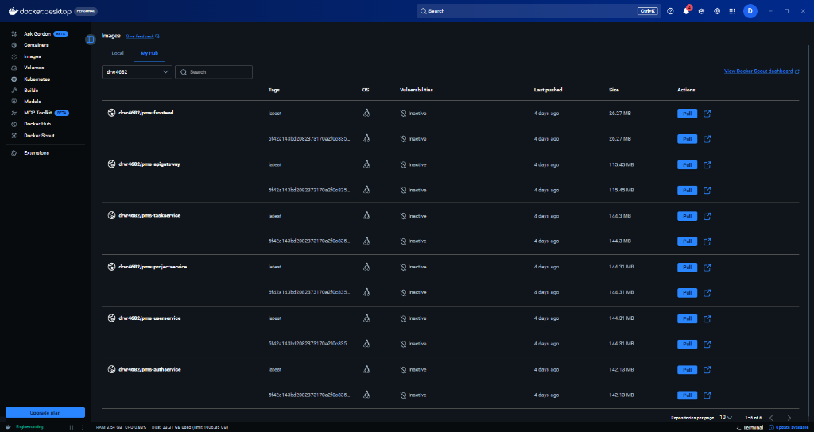

---

## 🤖 CI/CD Automation Workflow

The repository configures automation workflows using GitHub Actions:

1. **Continuous Integration (`ci.yml`)**:
   - Triggers on push or pull requests to `main` and `develop`.
   - Runs backend unit tests, installs the common library, compiles frontend assets (`npm run build`), and checks for code style violations (`eslint`).
2. **Continuous Delivery (`docker.yml`)**:
   - Triggers on the completion of the CI workflow on the `main` branch, or via manual trigger (`workflow_dispatch`).
   - Authenticates with DockerHub, builds production images using Docker Buildx caching, and publishes them with the `latest` tag and the git `commit SHA` tag.

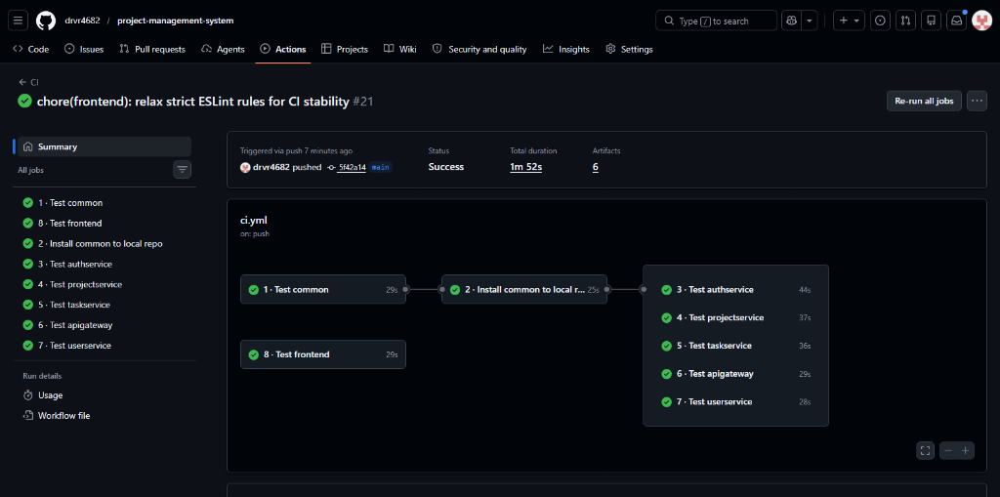

---

## 📸 Screenshots

### 🔐 Authentication & Verification Flow

#### Login Page
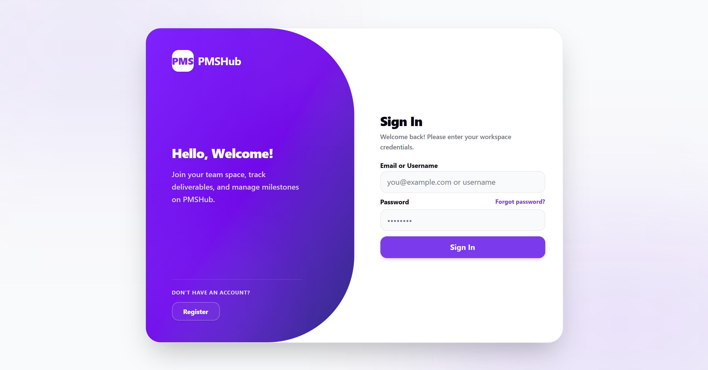

#### Register Page
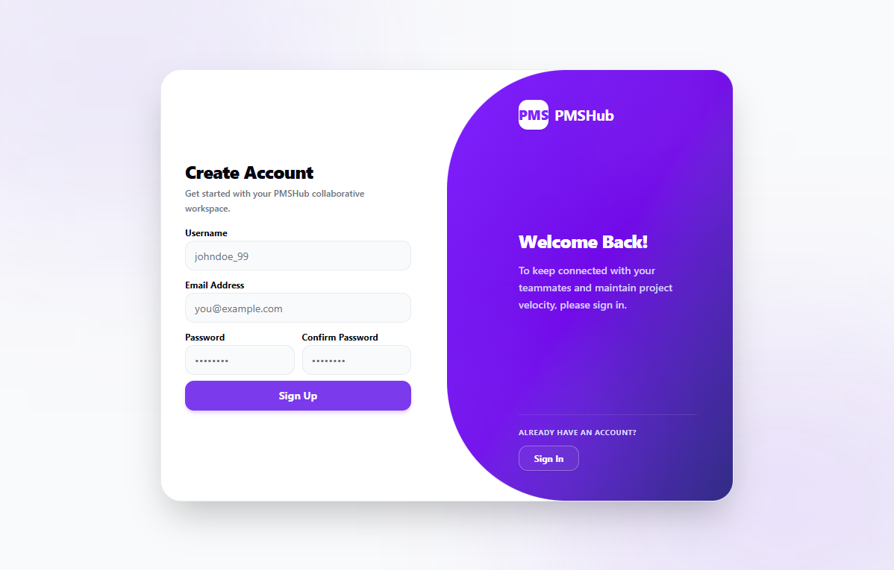

#### Email Verification Page
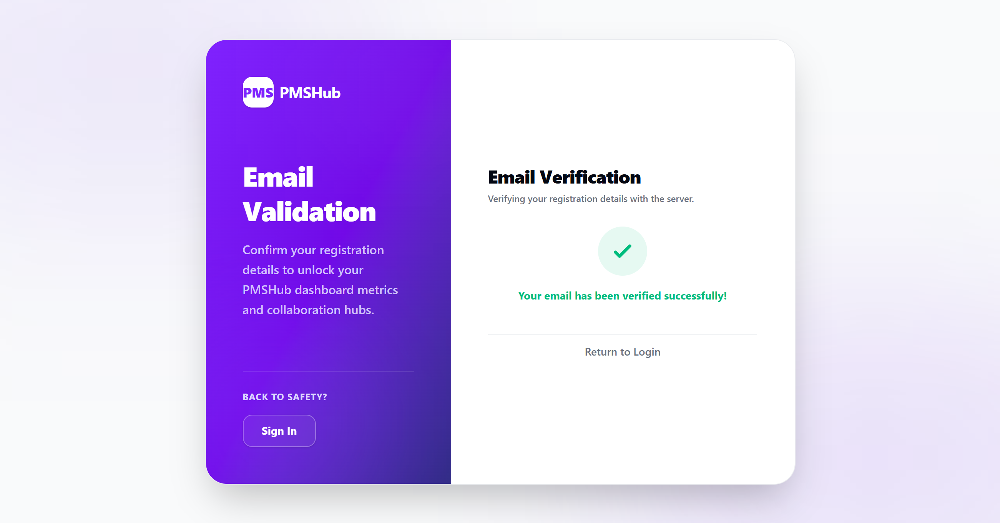

#### Forgot Password Page
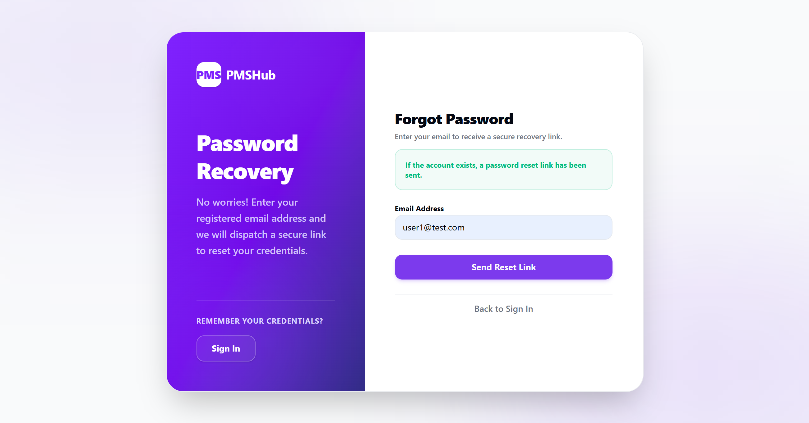

#### Reset Password Page
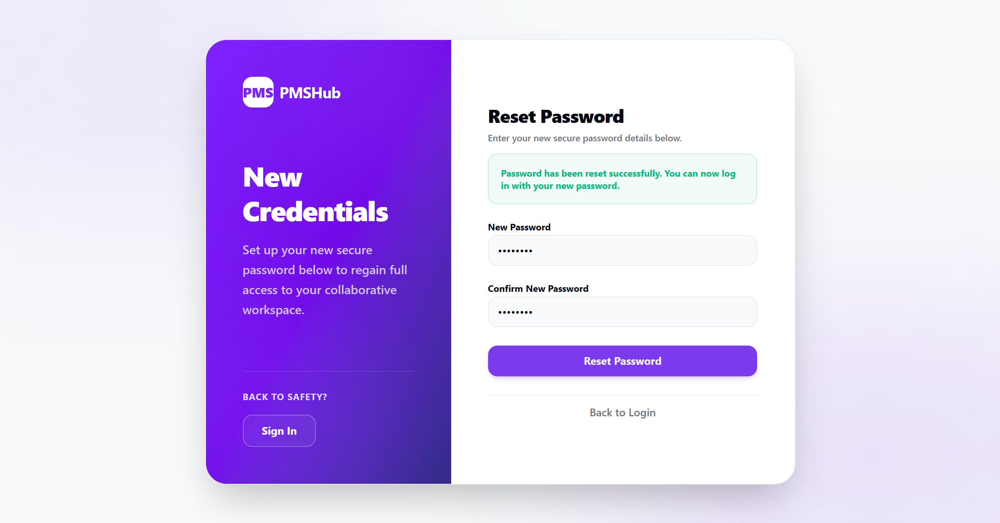

#### Change Password Dialog
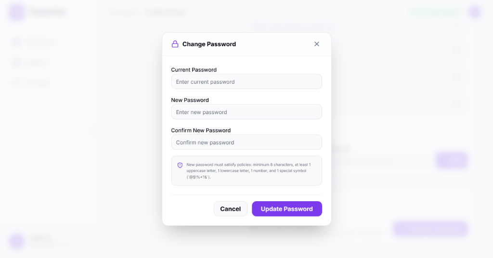

### 📊 Dashboard & Workspace Management

#### User Dashboard
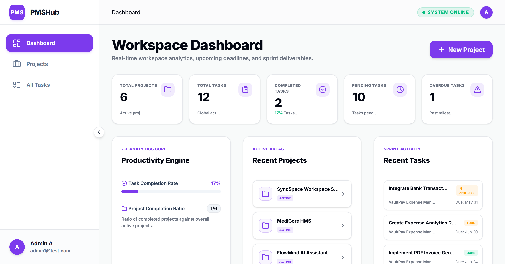

#### Create Workspace Dialog
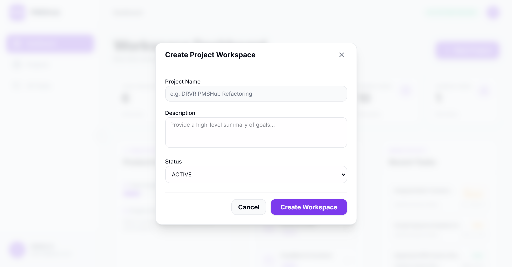

#### Edit Workspace Settings
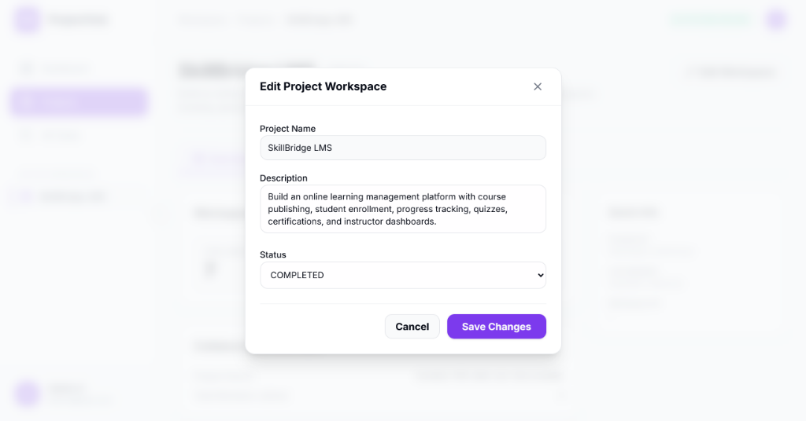

### 📂 Workspace Detail Views

#### Project Workspace Overview
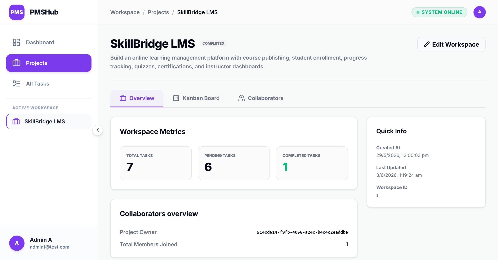

#### Project Workspace Collaborators
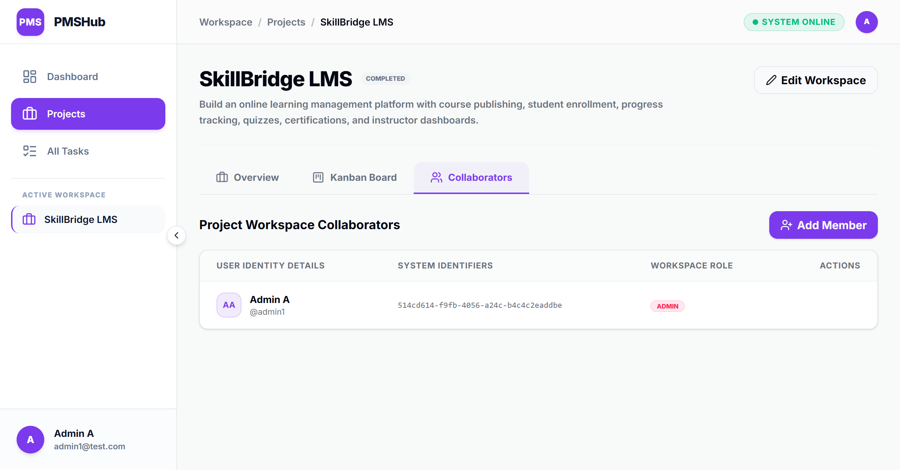

#### Invite Collaborator Dialog
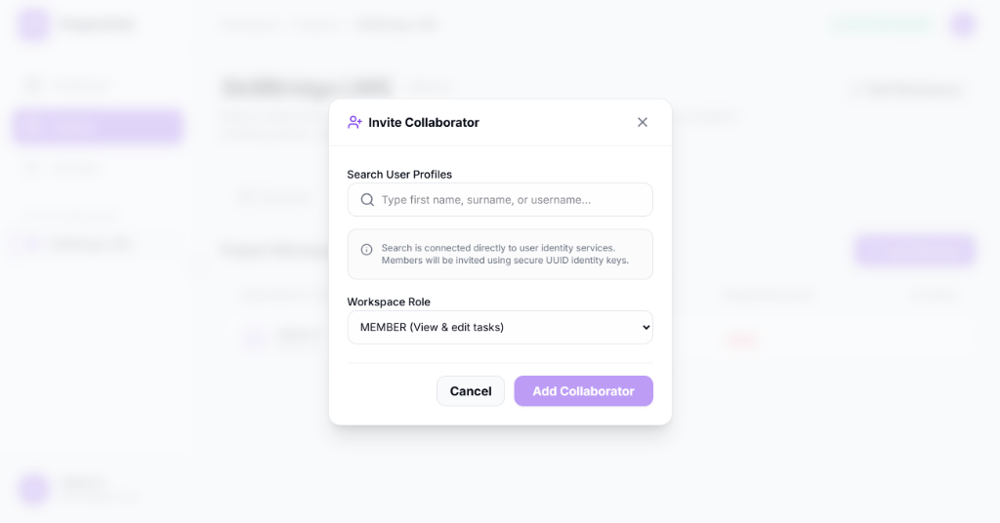

### 📋 Task Management

#### Kanban Board (Workspace Specific)
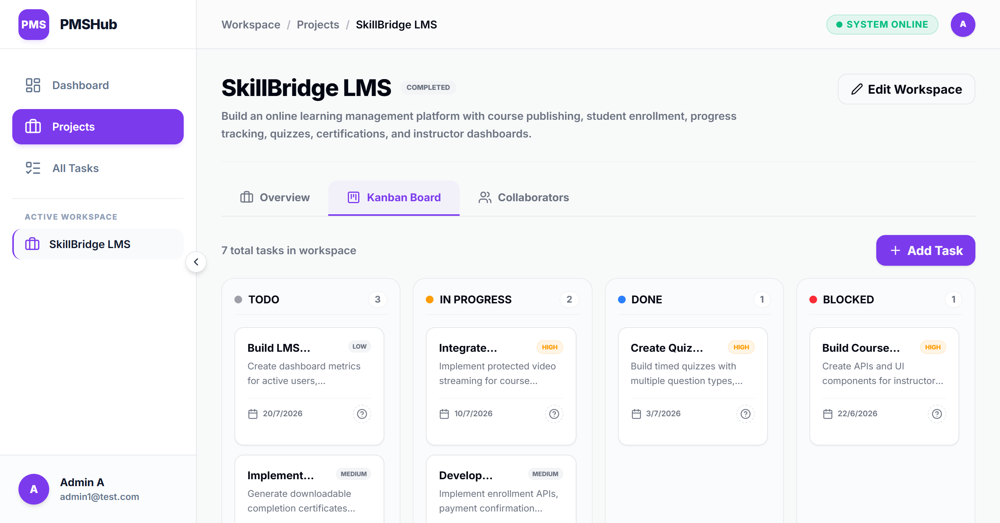

#### Global Task Board
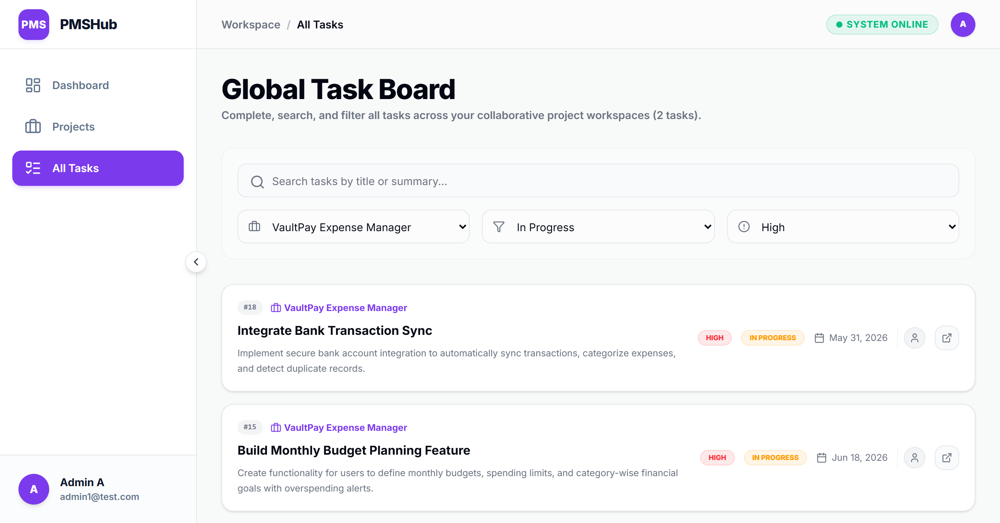

### 👤 User Profile & Settings

#### Account Settings (Professional Profile)
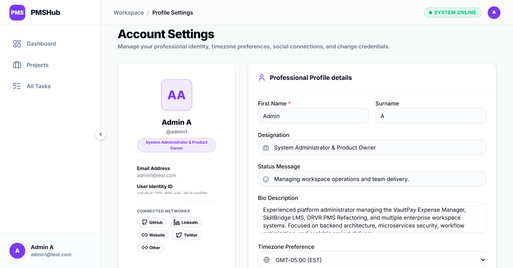

#### Connected Social Networks
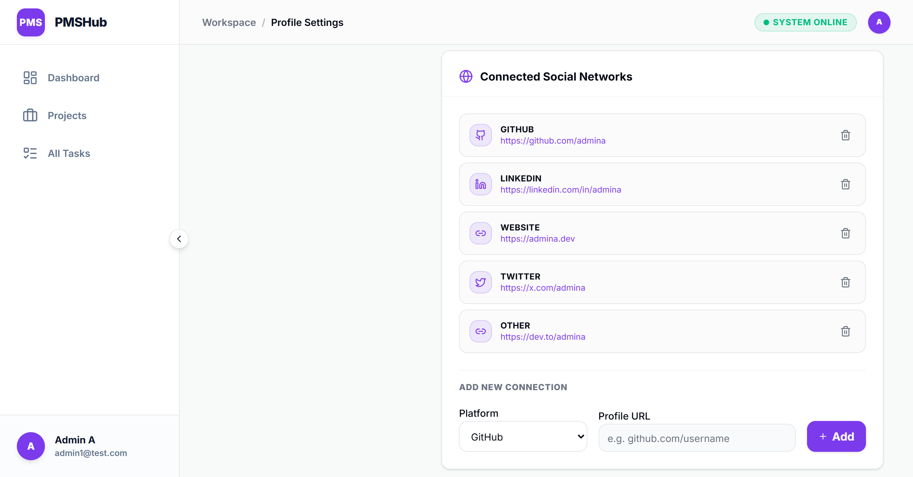


---

## 🔮 Future Improvements

- Implement microservice-to-microservice mutual TLS (mTLS) for backend communications.
- Add vulnerability scanning using Trivy inside the Docker build pipeline.
- Migrate to Spring Cloud Config Server for centralized external config management.

---

## 📄 License

This project is licensed under the MIT License - see the [LICENSE](LICENSE) file for details.